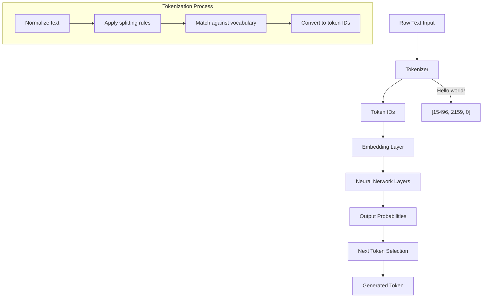

# Why Tokenisation Is the Hidden Engine of LLMs

When we marvel at large language models (LLMs) like GPT-4 or Claude generating human-like text, we often focus on their massive parameter counts or training data. But there's an unsung hero working behind the scenes that makes all of this possible: tokenization.

## What Is Tokenization?

At its core, tokenization is the process of converting raw text into discrete units that a language model can process. These units, called tokens, are the fundamental building blocks that LLMs manipulate.

```
"Hello world!" → ["Hello", "world", "!"]
```

But modern LLMs don't simply split text by spaces and punctuation. They use sophisticated tokenization algorithms that break text down into subword units based on statistical patterns in the training data.

## Why Subword Tokenization Matters

Earlier approaches to NLP often used word-level tokenization, treating each word as a token. This approach had serious limitations:

1. **Vocabulary explosion**: A model would need millions of tokens to cover all possible words
2. **Out-of-vocabulary words**: Any word not seen during training would be completely unknown
3. **Inefficient representation**: Common prefixes and suffixes would be duplicated across words

Subword tokenization solves these problems by breaking words into meaningful fragments:

```
"unhappiness" → ["un", "happiness"]
"playing" → ["play", "ing"]
```

## How Modern Tokenizers Work

Most modern LLMs use variations of Byte-Pair Encoding (BPE) or similar algorithms. The process works by:

1. Starting with individual characters
2. Repeatedly merging the most frequent pairs of adjacent tokens
3. Stopping when a desired vocabulary size is reached

This creates a vocabulary where common words remain intact, while rare words get split into meaningful subwords.

## The Hidden Impact of Tokenization

Tokenization choices profoundly impact what LLMs can do:

- **Language Support**: Models tokenize different languages with varying efficiency. English often gets tokenized efficiently, while languages with different scripts may require more tokens for the same text.
- **Content Bias**: If certain technical terms, names, or cultural references get split into many tokens, the model may represent them less effectively.
- **Token Economy**: When using LLMs via API, you pay per token. Efficient tokenization directly impacts costs.

## The Tokenization Diagram



## Why This Matters

As users and builders of AI systems, understanding tokenization helps us:

1. **Debug odd behaviors**: When models seem to struggle with specific words or phrases, tokenization may be the culprit
2. **Design better prompts**: Crafting prompts with tokenization in mind can improve results
3. **Build more inclusive systems**: Creating tokenizers that handle diverse languages and contexts fairly

Next time you're amazed by an LLM's capabilities, remember the hidden engine working behind the scenes: the humble but powerful tokenizer, silently parsing and preparing every word you exchange with AI.

The difference between a great language model and a mediocre one often begins not with its parameters or architecture, but with how it breaks down language into its fundamental pieces. 